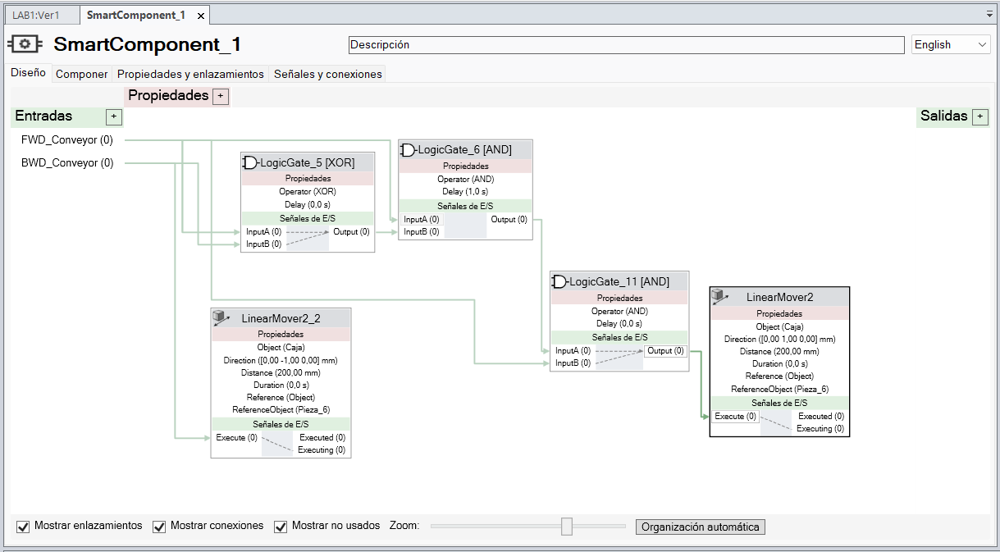
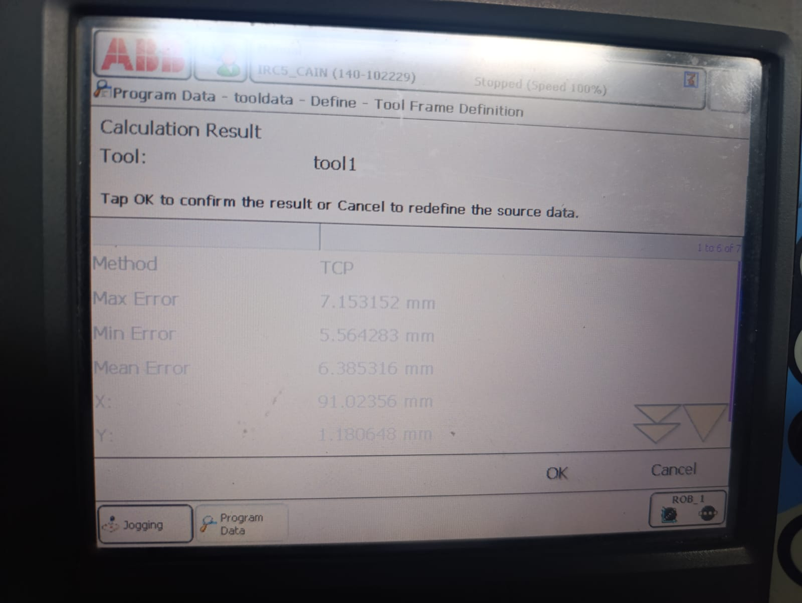

<div align="center">

<h3>Laboratorio No. 01</h3>

<h1>Robótica Industrial - Trayectorias, Entradas y Salidas Digitales.</h1>

<br>

<b>Figura 1. Manipuladores ABB IRB 140</b>

</div>

---

## Introduccíon

En el presente laboratorio se aborda la aplicación de conceptos fundamentales de robótica industrial enfocados en la generación de trayectorias, el uso de herramientas, y la interacción con entradas y salidas digitales con un manipulador (ABB IRB 140), un controlador (IRC5) y  una banda transportadora. Asimismo, este proceso se complementa con la simulación en el software RobotStudio, lo que permite validar y analizar el comportamiento del sistema en un entorno virtual.

En este sentido, a partir de un escenario inspirado en la automatización de procesos en la industria de alimentos, específicamente en la decoración de tortas, se plantea el desarrollo de una rutina capaz de ejecutar la decoración de una torta virtual, integrando programación en RAPID, calibración de herramientas y control del entorno de trabajo.

Para ello, se consideraron los siguientes requerimientos:

- El tamaño de la torta es para 20 personas  
- Las trayectorias a desarrollar deberán realizarse en un rango de velocidades entre 100 y 1000.  
- La zona tolerable de errores máxima debe ser de z10.  
- El movimiento debe partir de una posición home especificada (puede ser el home del robot) y realizar la trayectoria de cada palabra y decoración con un trazo continuo. El movimiento debe finalizar en la misma posición de home en la que se inició.  
- La decoración de la torta debe ser realizada sobre una torta virtual.  
- Los nombres deben estar separados.

---


## Solución planteada

En primer lugar, para simular la decoración de una torta, como herramienta se utilizó un marcador y se diseñó un soporte para acoplarlo al flanche del robot; además, como torta se definió una caja de 22×19 cm con un alto de 5 cm. Posteriormente, con estas medidas se diseñó la decoración de la torta; esta se modeló para utilizarla como guía en RobotStudio para construir las trayectorias.

<div align="center">

<table>
  <tr>
    <td align="center">
      <br>
      <b>Figura 2. Modelado herramienta</b>
    </td>
    <td align="center">
      <br>
      <b>Figura 3. Diseño decoración</b>
    </td>
    <td align="center">
      <br>
      <b>Figura 4. Modelado torta</b>
    </td>
  </tr>
</table>

</div>

Con esto, primero se trabajó en RobotStudio, en el que teniendo el manipulador y la banda se agregaron los modelados de la herramienta (tool) y de la torta (workobject) donde se iba a escribir, y se calibraron; luego se definieron los targets y las trayectorias, y con el lenguaje de programación RAPID se creó la rutina de decorado y de mantenimiento (el cual se eligió en una zona en la que en el laboratorio real no existieran interferencias). Para ello se utilizó una velocidad de 100 mm/s y una tolerancia de 1 mm, y se tuvieron en cuenta elementos del laboratorio que pudieran intervenir en los movimientos del robot, como la otra banda.  

<div align="center">

<br>
<b>Figura 5. Simulación en RobotStudio</b>

</div>

Siguiendo esto, para incorporar las entradas y salidas digitales se definió:

- **DI_01:** Acciona la banda 3 segundos para posicionar la torta en la posición de decorado y ejecuta rutina de decoración. Al terminar, regresa el robot a home y acciona la banda 5 segundos para llevar la torta a la posición de entrega.  
- **DI_02:** Lleva el robot a pose de mantenimiento y se mantiene hasta que se vuelva accionar este entrada por máximo 10 segundos 
- **DI_03:** Acciona la banda 3 segundos para posicionar la torta en la posición inicial.  

- **DO_01:** Enciende un indicador mientras el robot desarrolla la rutina de decoración.  
- **DO_03:** Enciende un indicador mientras el robot se encuentra en la pose de mantenimiento.  

Cabe mencionar que en RobotStudio no se simuló el movimiento de la banda; en su lugar se movió el *workobject*. Finalmente, con la simulación funcionando, se pasó a la práctica y, así como se hizo antes, lo primero fue realizar la calibración de la herramienta y de la torta; con estas se probó el código de RAPID y se realizaron algunas iteraciones dada la posición real del *workobject* hasta obtener la rutina esperada.

<div align="center">

<table>
  <tr>
    <td align="center">
      <br>
      <b>Figura 6. Herramienta montada</b>
    </td>
    <td align="center">
      <br>
      <b>Figura 7. Decoración obtenida</b>
    </td>
    <td align="center">
      <br>
      <b>Figura 8. Torta</b>
    </td>
  </tr>
</table>

</div>

---

## Diagrama de flujo de acciones del robot

---

## Plano de planta de la ubicación de cada uno de los elementos

---

## Funciones utilizadas

Se utilizaron las tres funciones MoveJ, MoveL y MoveC; el uso de cada una se describe a continuación.

MoveJ consiste en una función que envía al TCP a un punto determinado sin seguir una trayectoria definida; el robot define la trayectoria que considere más conveniente. MoveJ se utilizó principalmente para ir a home y para puntos intermedios, principalmente los que nos provocaron un problema de "Join Out of Range".

MoveL es una función que mueve el TCP hasta un punto siguiendo estrictamente una línea recta, desde el punto actual. Las instrucciones que utilizaron MoveL fueron principalmente las que definen la trayectoria de los nombres, en las partes rectas de los mismos o en algunas partes donde se colocaron muchas trayectorias para asemejar una curva, y algunas aproximaciones. Entre letra y letra se emplearon MoveJ, aunque inicialmente se había intentado utilizar MoveL, lo cual generó algunos problemas.

MoveC es una función que mueve el TCP en una curva, uniendo tres puntos: el punto desde donde parte, un punto intermedio y un punto final. MoveC se usó más que todo en las trayectorias de la figura del medio, ya que consiste más que todo en curvas y círculos, y en las partes curvas de las letras, tales como las curvas de la letra "a" o de la letra "p".

También se emplearon las funciones Set y Reset. Set se usa para poner en verdadero (1) el estado lógico de una salida, mientras que Reset pone en falso (0) el estado lógico de una salida. Estas dos funciones se emplearon para dos cosas. La primera es la de encender o apagar los pilotos que señalizan cada una de las etapas del proceso. La otra aplicación fue en la activación y desactivación de la banda transportadora, cambiando el estado de las salidas BWD_Conveyor y FWD_Conveyor.

Además, usamos la función WaitTime, que genera un retraso de tiempo especificado en segundos. Se usó para definir el tiempo que se demora la banda transportadora en llevar la "torta" de un punto A a un punto B y de un punto B a un punto C. Se tomaron tiempos de espera de 3 segundos para llevar la torta al lugar donde el robot hará la figura y 5 segundos para sacarla del lugar de trabajo del robot; esto se verá con detalle más adelante.

Otras funciones que usaron, concretamente para la simulación en RobotStudio, fueron las funciones LinearMove2 y LogicGate. LA función LinearMove2 mueve un objeto de la simulación de manera lineal respecto a otro objeto. Específicamente, se movió el objeto que representa a la "torta" respecto al modelo de la banda transportadora, para representar la activación y desactivación de esta última. Se utilizaron dos de estas funciones, una para representar el movimiento a la derecha y la otra para representar el movimiento a la izquierda. Esto se puede hacer modificando el parámetro Direction, dejando para el primer caso los valores ([0,00 -1,00 0,00] mm) y para el segundo los valores de ([0,00 1,00 0,00] mm).

La función LogicGate fue necesaria utilizarla para poder simular correctamente el movimiento de la "torta" hacia la izquierda y hacia la derecha, considerando la forma en que se activa y desactiva la banda transportadora en el programa de RAPID. LogicGate permite configurar varios tipos de compuertas lógicas; en nuestro caso se utilizaron compuertas AND y una compuerta XOR.

<div align="center">

<br>
<b>Figura 9. SmartComponent utilizado para la simulación.</b>

</div>

---

## Diseño de la herramienta

En el diseño de la herramienta, se tuvieron en cuenta los siguientes aspectos:

- Debe asegurarse con tornillos al flanche del manipulador.
- El eje del marcador no puede quedar colineal al flanche del manipulador, dado que se puede generar una singularidad.
- El marcador no puede sujetarse de forma rígida, puesto que pueden existir errores de calibración.

Siguiendo esto, se utilizaron los planos del flanche del robot para modelar la unión a este; se definió que el marcador iría rotado 30° horizontalmente respecto al eje del flanche y se escogió un resorte para permitirle al marcador una tolerancia de 18 mm. Teniendo el modelado del soporte del marcador, este fue fabricado mediante impresión 3D en material PLA.

<div align="center">

<table>
  <tr>
    <td align="center">
      <br>
      <b>Figura 10. Explosionado de la herramienta</b>
    </td>
    <td align="center">
      <br>
      <b>Figura 11. Componentes herramienta</b>
    </td>
    <td align="center">
      <br>
      <b>Figura 12. Herramienta</b>
    </td>
  </tr>
</table>

</div>

<b>Planos de la herramienta</b>

[Ver planos de la herramienta](Anexos/Planos_herramienta.pdf)

---

## Código en RAPID 
Para la programación de las trayectorias del robot acorde a los requerimientos del ejercicio, se tomó la siguiente lógica. Con el fin de ser más concisos y breves en esta explicación, se omitieron la ubicación de los puntos, el workobject y el código de cada una de las trayectorias de forma individual; en consecuencia, se mostrará la rutina principal (MAIN) del programa.

Como el trabajo que debe realizar la máquina debe ser cíclico, lo primero que se establece es un ciclo while que siempre se ejecuta y que contiene todo lo demás. 
```rapid
   PROC main()
        WHILE TRUE DO
        ...
        ENDWHILE
    ENDPROC
```
Lo primero que se ejecuta en el ciclo es el regreso al home de la máquina, acompañado de apagar todos los pilotos, ya que se está inicializando la posición del robot.
```rapid
          ...  
            Reset DO_01;
            Reset DO_03;
            Path_10;
          ...
```
Tras esto, en el código se establecen una serie de condiciones relacionadas con las entradas DI_01, DI_03 y DI_03. La primera condición es un if que corresponde con el proceso de mover la banda transportadora en retroceso; esto se hace con el fin de facilitar la ubicación de la pieza para realizar las demás rutinas del ejercicio. El movimiento tiene una duración de 3 segundos.

```rapid
    ...
            IF DI_03=1 THEN
                Set FWD_Conveyor;
                WaitTime 3;
                Reset FWD_Conveyor;
            ENDIF
    ...
```

La segunda y tercera condición se encuentran en un if-elseif, donde el primer if cumple la función de mandar al robot a la posición de mantenimiento con el pulsador DI_03. En esta posición, el robot se ubica en una posición cómoda para cambiar la herramienta. Dentro de este if se encuentra un while que mantiene al robot en la posición de mantenimiento hasta que se vuelve a presionar el pulsador DI_03 por un máximo de 10 segundos. Adicionalmente, durante el tiempo que el robot se encuentra en mantenimiento, el piloto número tres *DO_03* permanece encendido.

```rapid
    ...
            IF DI_02=1 THEN
                Path_01;
                Set DO_03;
                WHILE DI_02=0 DO
                    WaitTime 10;
                ENDWHILE
                Reset DO_03;
    ...
```

En caso de que *DI_03* no fue el que se presionó, entonces se evalúa la condición de que *DI_02* fuese presionado. En caso de que no, entonces se regresa a home. En caso de que sí, entonces se ejecuta la rutina de decorado, durante la cual el piloto número uno *DO_01* permanece encendido hasta que finaliza toda la rutina.

En este proceso comenzamos activando la banda transportadora por 3 segundos y luego la apagamos; esto ubica la "torta" en la posición deseada. Luego manda el manipulador a la posición de home para luego comenzar y ubicarse en un punto intermedio entre home y la torta. Luego se ubica a 10 cm de la superficie de la torta, tras lo cual empieza a hacer la figura sobre el objeto, comenzando por la figura como tal y, tras terminar, escribe los nombres. Al finalizar la figura y los nombres, retorna al punto intermedio y luego a la posición de home. Luego activa nuevamente la banda transportadora.

Para dibujar la figura central se utilizaron tres rutinas, las cuales fueron Path_170, que describe la forma exterior de la figura semejante a una "flor", Path_190, la cual es el círculo grande, y Path_200, que describe al círculo pequeño. Tras esto, en el Path_210 se realiza el dibujo de los nombres, comenzando con el de Paula, luego el de David y finalmente el de Jesús. Como podrá observar, el dibujo de los nombres se realizó en una sola rutina, un poco más extensa.

```rapid
    ...
            ELSEIF DI_01=1 THEN
                Set DO_01;
                Set BWD_Conveyor;
                Set FWD_Conveyor;
                WaitTime 3;
                Reset BWD_Conveyor;
                Reset FWD_Conveyor;
                Path_10;
                Path_170;
                Path_190;
                Path_200;
                Path_210;
                Path_10;
                Set BWD_Conveyor;
                Set FWD_Conveyor;
                WaitTime 5;
                Reset FWD_Conveyor;
                Reset BWD_Conveyor;
                Reset DO_01;
            ELSE
                Path_10;
            ENDIF
    ...
```

<b>Código completo del ejercicio:</b>

[Ver código](Anexos/Codigo_RAPID.txt)

---

## Resultados

<div align="center">

<br>
<b>Figura 13. Error en la calibración de la herramienta</b>

</div>

Se realizó la calibración real y en la simulación del TCP de la herramienta, obteniendo en la real un error máximo de 7.1 mm (Figura 12), el cual estaba dentro de la tolerancia de la herramienta; sin embargo, para la práctica se utilizó la calibración de RobotStudio. Por otro lado, para la torta no fue igual, puesto que existen algunos aspectos que no se tuvieron en cuenta en la simulación, como la inclinación de la banda transportadora o la pequeña presión que se debía ejercer sobre el marcador para que este escribiera. Por ello, fue necesario iterar y se obtuvo un resultado satisfactorio. Adicionalmente, en simulación se replicó la tarea de decorado sobre el cuadrante x(+), y(−). Finalmente, se realizó un video con las simulaciones y la práctica.

<div align="center">
  <a href="https://www.youtube.com/watch?v=HJSt0lsINJk">
    <br>
    <b>Haz clic en la imagen para ver el video</b>
  </a>
</div>
