

<h3>Laboratorio No. 01</h3>

<h1>Robótica Industrial - Trayectorias, Entradas y Salidas Digitales.</h1>

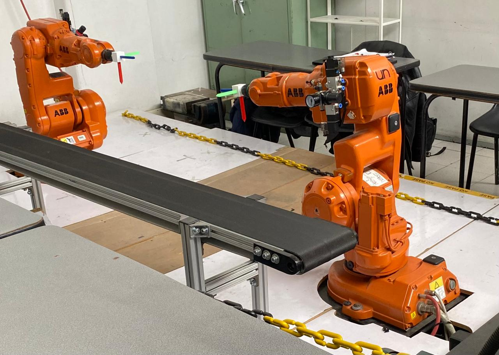 

<b>Figura 1. Manipuladores ABB IRB 140</b>

---

## Introduccíon

En el presente laboratorio se aborda la aplicación de conceptos fundamentales de robótica industrial enfocados en la generación de trayectorias, el uso de herramientas, y la interacción con entradas y salidas digitales con un manipulador (ABB IRB 140), un controlador (IRC5) y  una banda transportadora. Asimismo, este proceso se complementa con la simulación en el software RobotStudio, lo que permite validar y analizar el comportamiento del sistema en un entorno virtual.

En este sentido, a partir de un escenario inspirado en la automatización de procesos en la industria de alimentos, específicamente en la decoración de tortas, se plantea el desarrollo de una rutina capaz de ejecutar la decoración de una torta virtual, integrando programación en RAPID, calibración de herramientas y control del entorno de trabajo.

Para ello, se consideraron los siguientes requerimientos:

- El tamaño de la torta es para 20 personas  
- Las trayectorias a desarrollar deberán realizarse en un rango de velocidades entre 100 y 1000.  
- La zona tolerable de errores máxima debe ser de z10.  
- El movimiento debe partir de una posición home especificada (puede ser el home del robot) y realizar la trayectoria de cada palabra y decoración con un trazo continuo. El movimiento debe finalizar en la misma posición de home en la que se inició.  
- La decoración de la torta debe ser realizada sobre una torta virtual.  
- Los nombres deben estar separados.

---

## Solución planteada

En primer lugar, para simular la decoración de una torta, como herramienta se utilizó un marcador y se diseñó un soporte para acoplarlo al flanche del robot; además, como torta se definió una caja de 22×19 cm con un alto de 5 cm. Posteriormente, con estas medidas se diseñó la decoración de la torta; esta se modeló para utilizarla como guía en RobotStudio para construir las trayectorias.

<table>
  <tr>
    <td align="center">
      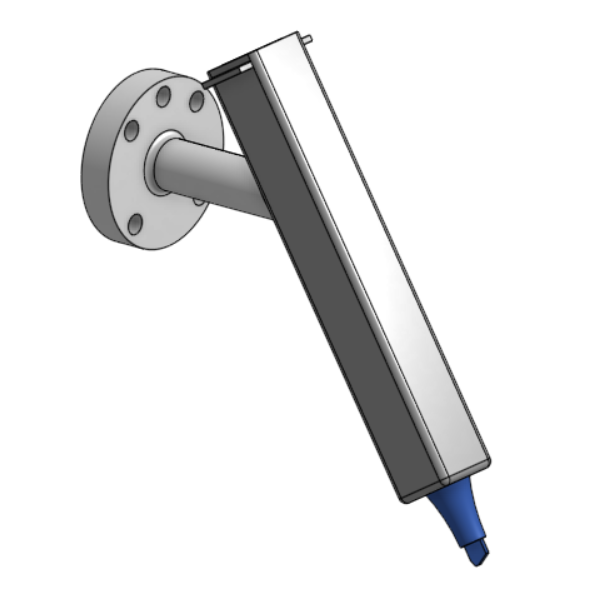 
      <b>Figura 2. Modelado herramienta</b>
    </td>
    <td align="center">
      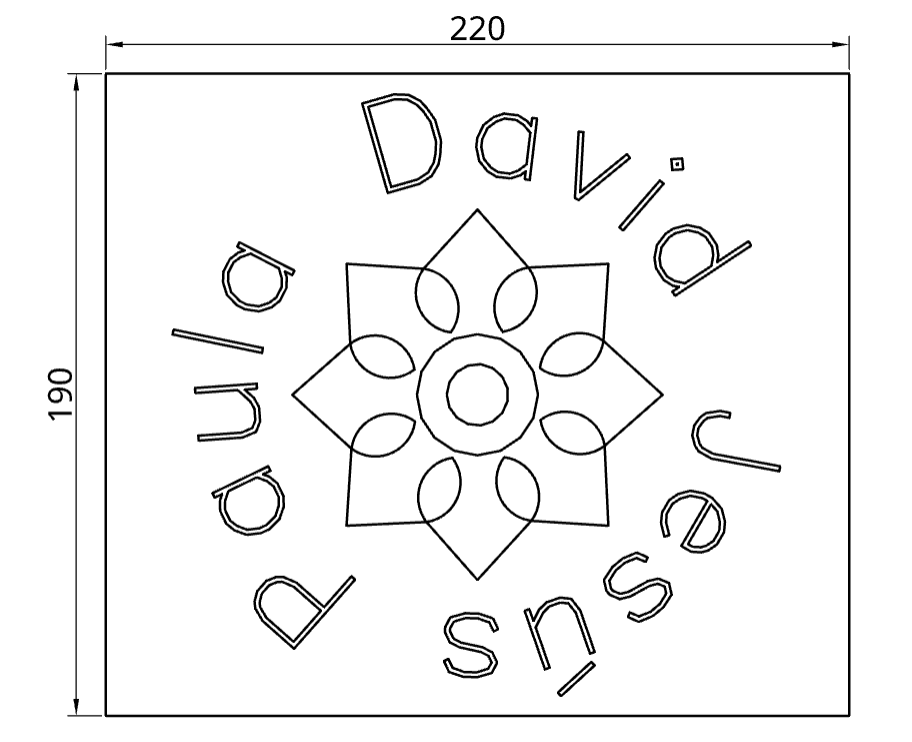 
      <b>Figura 3. Diseño decoración</b>
    </td>
    <td align="center">
      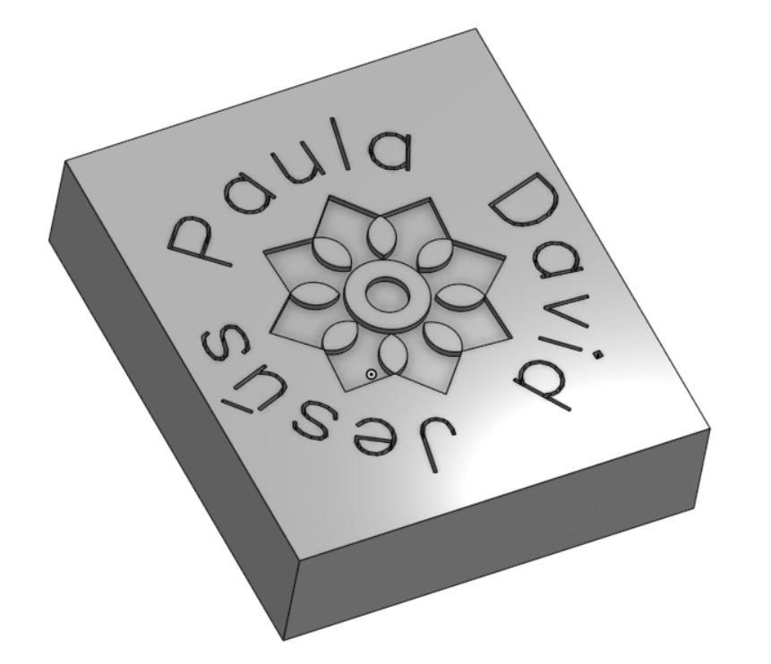 
      <b>Figura 4. Modelado torta</b>
    </td>
  </tr>
</table>

Con esto, primero se trabajó en RobotStudio, en el que teniendo el manipulador y la banda se agregaron los modelados de la herramienta (tool) y de la torta (workobject) donde se iba a escribir, y se calibraron; luego se definieron los targets y las trayectorias, y con el lenguaje de programación RAPID se creó la rutina de decorado y de mantenimiento (el cual se eligió en una zona en la que en el laboratorio real no existieran interferencias). Para ello se utilizó una velocidad de 100 mm/s y una tolerancia de 1 mm, y se tuvieron en cuenta elementos del laboratorio que pudieran intervenir en los movimientos del robot, como la otra banda.  

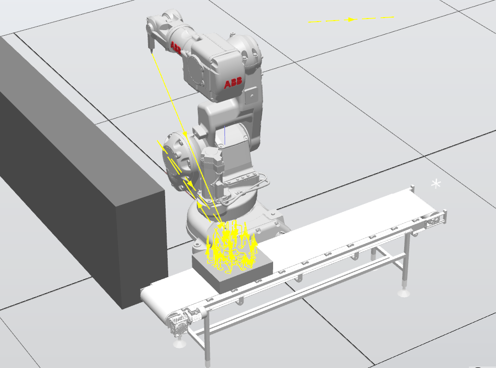 
<b>Figura 5. Simulación en RobotStudio</b>

Siguiendo esto, para incorporar las entradas y salidas digitales se definió:

- **DI_01:** Acciona la banda 3 segundos para posicionar la torta en la posición de decorado y ejecuta rutina de decoración. Al terminar, regresa el robot a home y acciona la banda 5 segundos para llevar la torta a la posición de entrega.  
- **DI_02:** Lleva el robot a pose de mantenimiento y se mantiene hasta que se vuelva accionar este entrada por máximo 10 segundos 
- **DI_03:** Acciona la banda 3 segundos para posicionar la torta en la posición inicial.  

- **DO_01:** Enciende un indicador mientras el robot desarrolla la rutina de decoración.  
- **DO_03:** Enciende un indicador mientras el robot se encuentra en la pose de mantenimiento.  

Cabe mencionar que en RobotStudio no se simuló el movimiento de la banda; en su lugar se movió el *workobject*. Finalmente, con la simulación funcionando, se pasó a la práctica y, así como se hizo antes, lo primero fue realizar la calibración de la herramienta y de la torta; con estas se probó el código de RAPID y se realizaron algunas iteraciones dada la posición real del *workobject* hasta obtener la rutina esperada.

<table>
  <tr>
    <td align="center">
      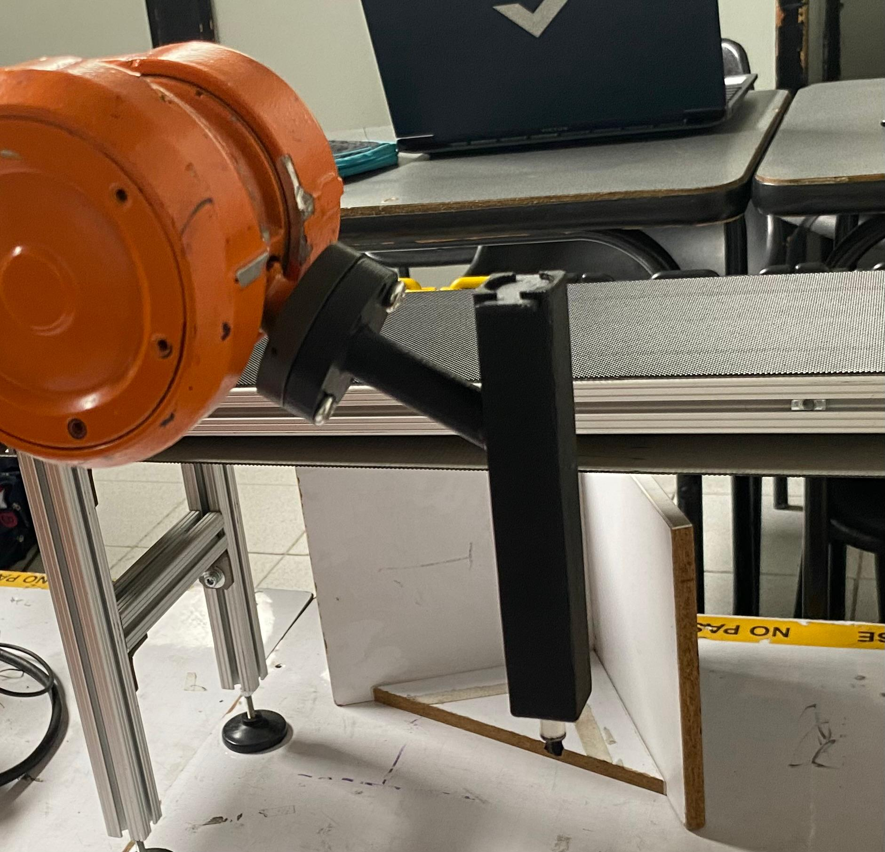 
      <b>Figura 6. Herramienta montada</b>
    </td>
    <td align="center">
      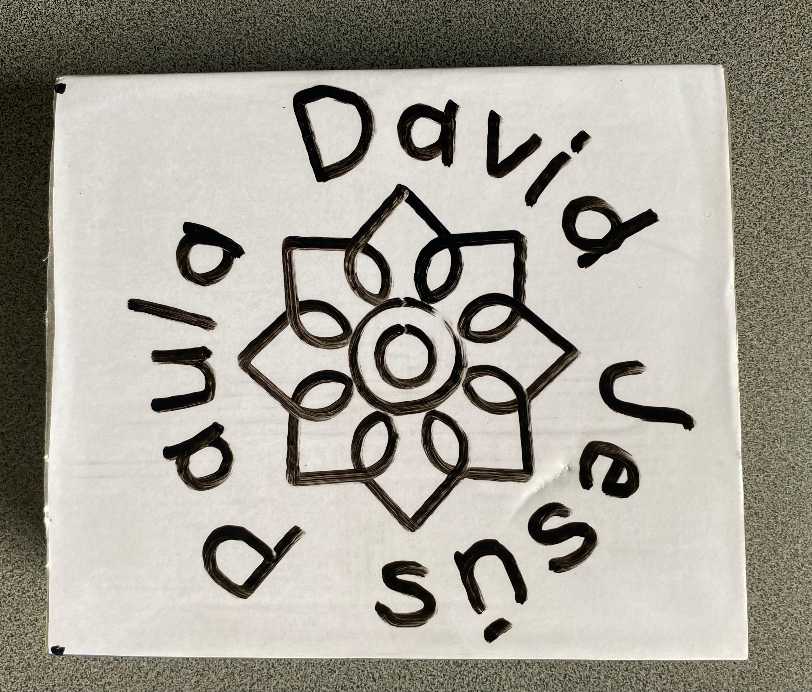 
      <b>Figura 7. Decoración obtenida</b>
    </td>
    <td align="center">
      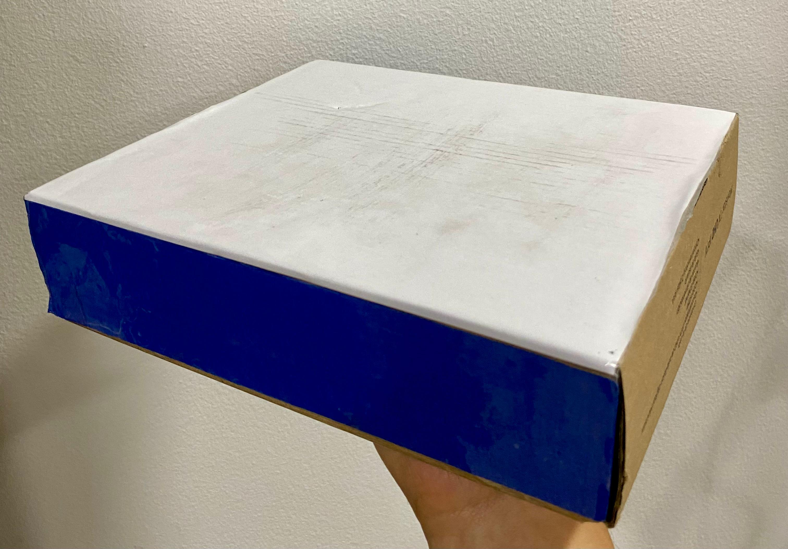 
      <b>Figura 8. Torta</b>
    </td>
  </tr>
</table>

---

## Diagrama de flujo de acciones del robot

---

## Plano de planta de la ubicación de cada uno de los elementos

---

## Funciones utilizadas

---

## Diseño de la herramienta

En el diseño de la herramienta, se tuvieron en cuenta los siguientes aspectos:

- Debe asegurarse con tornillos al flanche del manipulador.
- El eje del marcador no puede quedar colineal al flanche del manipulador, dado que se puede generar una singularidad.
- El marcador no puede sujetarse de forma rígida, puesto que pueden existir errores de calibración.

Siguiendo esto, se utilizaron los planos del flanche del robot para modelar la unión a este; se definió que el marcador iría rotado 30° horizontalmente respecto al eje del flanche y se escogió un resorte para permitirle al marcador una tolerancia de 18 mm. Teniendo el modelado del soporte del marcador, este fue fabricado mediante impresión 3D en material PLA.

<table>
  <tr>
    <td align="center">
      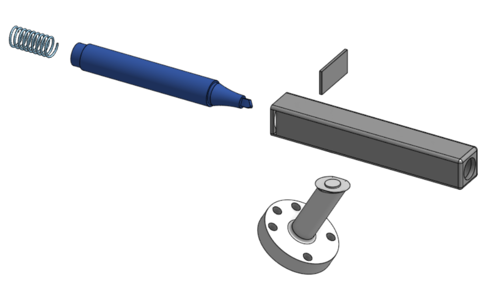 
      <b>Figura 9. Explosionado de la herramienta</b>
    </td>
    <td align="center">
      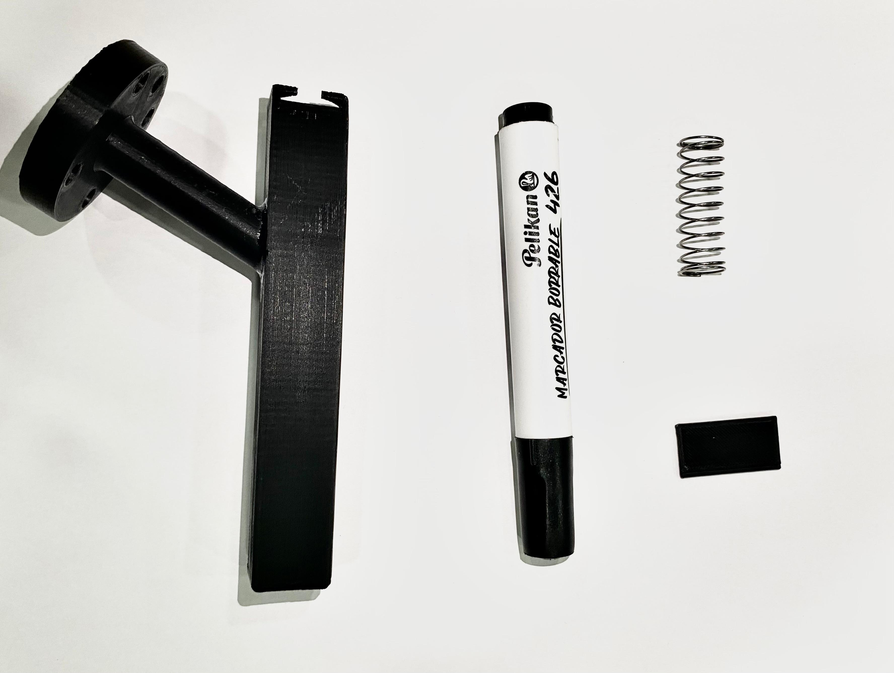 
      <b>Figura 10. Componentes herramienta</b>
    </td>
    <td align="center">
      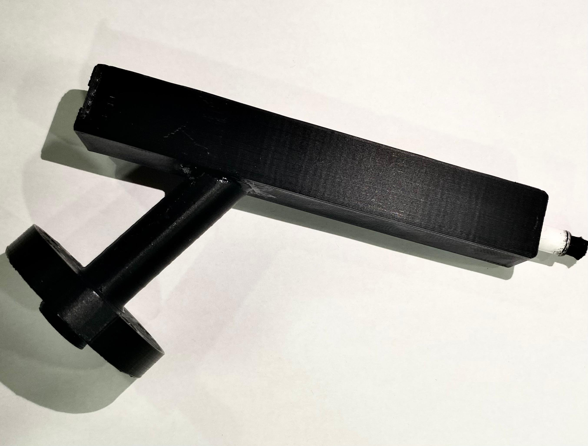 
      <b>Figura 11. Herramienta</b>
    </td>
  </tr>
</table>

<b>Planos de la herramienta</b>

[Ver planos de la herramienta](Anexos/Planos_herramienta.pdf)

---

## Código en RAPID 

---

## Resultados

Pastel
Vídeo simulación en RobotStudio
Vídeo implementación de la práctica con los robots reales.

